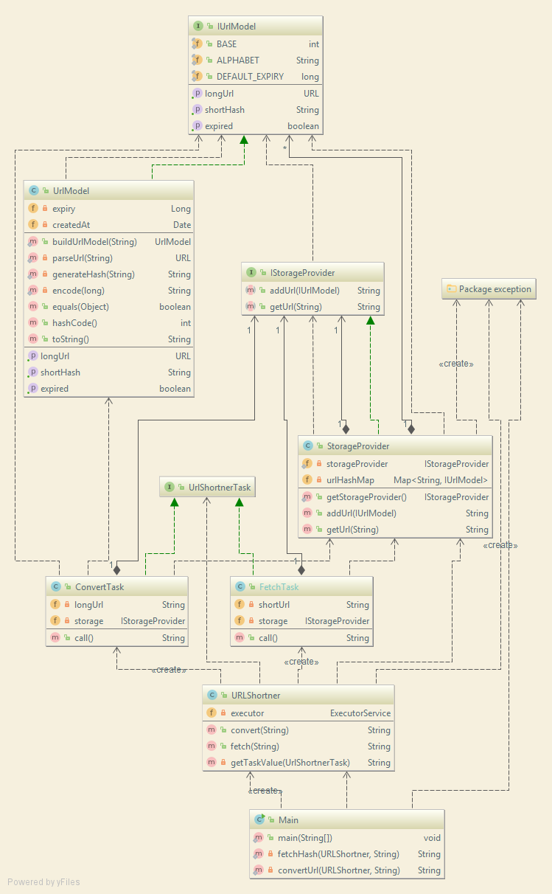
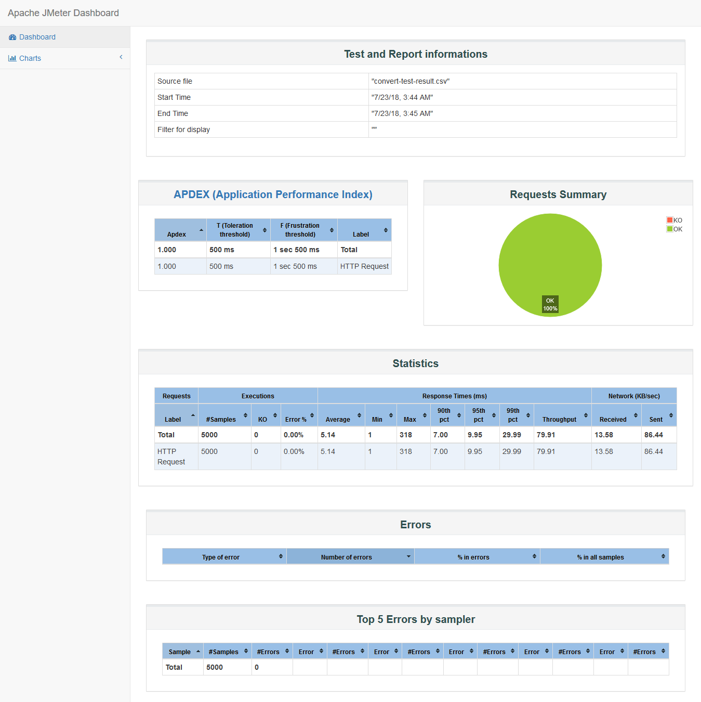
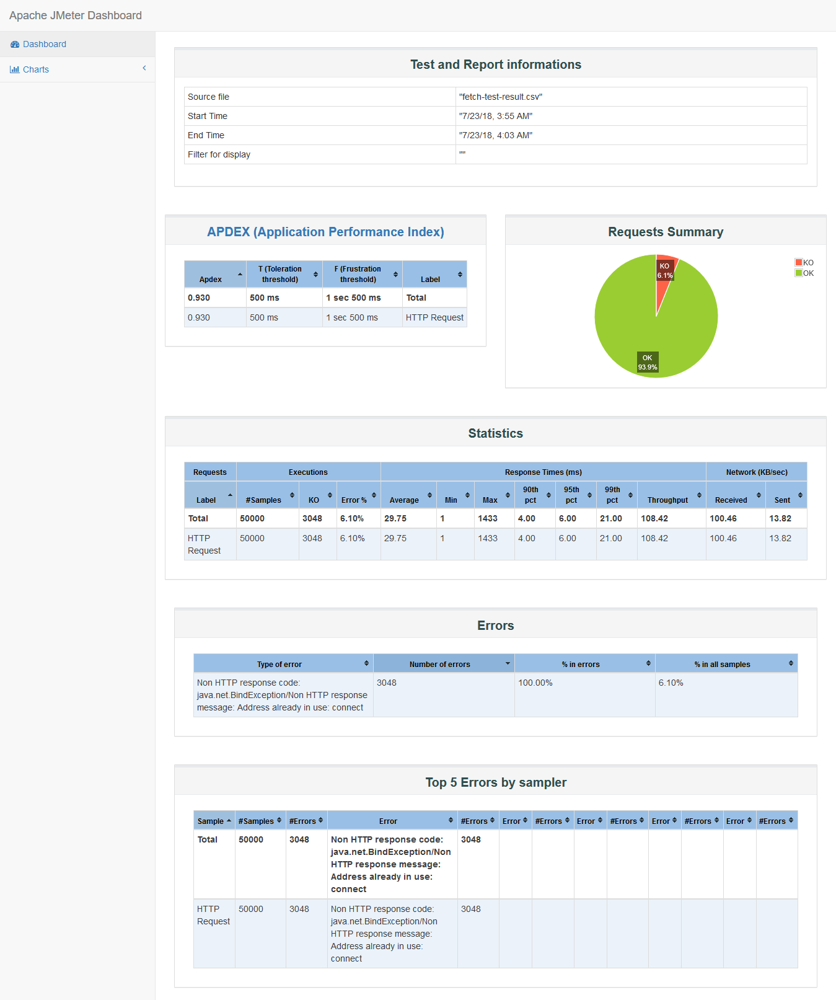

# URL Shortener Service

## Assignment
Create an URL Shortener Service like Tiny URL.
- The application should be designed to scale to support concurrent shorten URL requests of
5000 and forward requests of 50000 and average of 100000 hits daily.
- You should consider scenarios like – Duplicate URL, Expiry, long URL Support.

## Submission

- Please find the project for the assignment in `url-shortner-core` 

**UML Diagram**


**Build**
```
mvn clean install
```

**Run Main**
```
mvn exec:java
```


## Driver Program (Spark Java Rest Service)

- REST service can be found at `url-shortner-service`

**Build**
```
mvn clean install
```

**Run Main**
```
mvn exec:java
```

**Long URL to Short URL request (Shorten Request)**
```
curl -X POST http://localhost:8080/api/convert \
  -H 'Content-Type: application/x-www-form-urlencoded' \
  -d url=http%3A%2F%2Fwww.google.com
```

**Short URL To Long URL (Forward Request)**
```
curl -X GET 'http://localhost:8080/api/fetch?hash=ccnAp7BZT'
```

## Basic Performance Testing

**Shorten Request**


**Forward Request**
